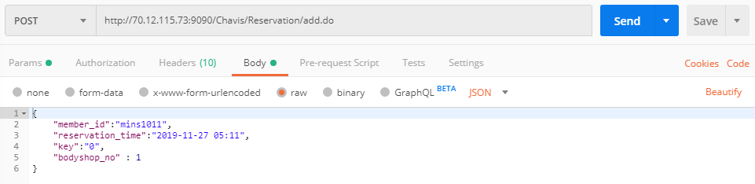
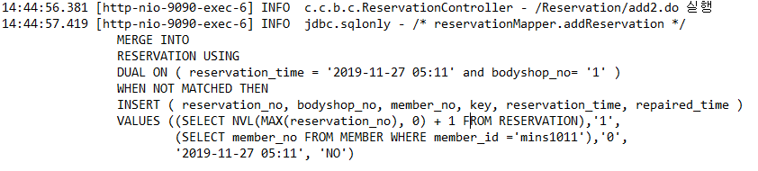
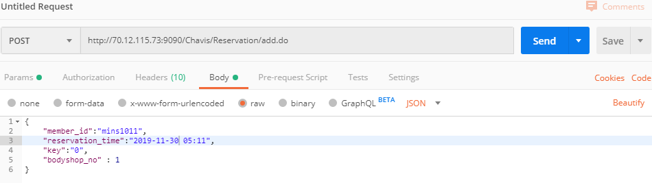
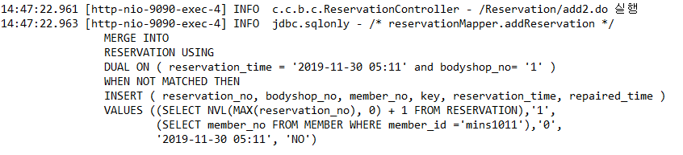
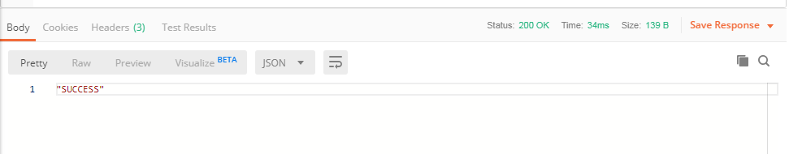

# CHAVIS HTTP SERVER

## 1. 구성


- 기본적인 Spring MVC 패턴을 따라서 Cotroller - Service - DAO 로 이어지는 로직을 사용하였다.
- 서버가 제대로 돌아가는지 확인하기 위하여 `logback`과 `Postman`을 이용하여 API 서버 테스트를 진행하였다.

-----

## 1. 설정

### 1.1 pom.xml

```xml
<!-- log4j -->
...
<dependency>
	<groupId>org.bgee.log4jdbc-log4j2</groupId>
	<artifactId>log4jdbc-log4j2-jdbc4</artifactId>
	<version>1.16</version>
</dependency>
<dependency>
    <groupId>org.slf4j</groupId>
    <artifactId>slf4j-api</artifactId>
    <version>1.7.28</version>
</dependency>
<dependency>
	<groupId>ch.qos.logback</groupId>
	<artifactId>logback-classic</artifactId>
	<version>1.1.7</version>
</dependency>
...
```

- `logback`을 사용하기 위한 `pom.xml` dependency 추가

### 1.2 **applicationContext.xml**

```xml
<bean id="dataSource" class="org.apache.commons.dbcp.BasicDataSource">
	<property name="driverClassName" value="net.sf.log4jdbc.sql.jdbcapi.DriverSpy" />
	<property name="url" value="jdbc:log4jdbc:oracle:thin:@70.12.115.70:1521:xe" />
	<property name="username" value="final"></property>
	<property name="password" value="1234"></property>
</bean>
```

- 서버가 잘 돌아가는지 Console에서 SQL문이 잘 돌아가는지 확인하기 위한 작업이다.
  - `driverClassName`과 `url`에 logback 관련 `value`를 넣어준다.

### 1.3 log4jdbc.log4j2.properties

```
log4jdbc.spylogdelegator.name=net.sf.log4jdbc.log.slf4j.Slf4jSpyLogDelegator
log4jdbc.dump.sql.maxlinelength=0
```

### 1.4 logback.xml

```xml
<?xml version="1.0" encoding="UTF-8" ?>
<!DOCTYPE xml>
<configuration scan="true" scanPeriod="3 seconds">
	<appender name="console"
		class="ch.qos.logback.core.ConsoleAppender">
		<layout>
			<pattern>
				%d{HH:mm:ss.SSS} [%thread] %-5level %logger{32} - %msg%n
			</pattern>
		</layout>
	</appender>

	<logger name="org.springframework" level="DEBUG" />

	<root level="INFO">
		<appender-ref ref="console" />
	</root>


	<logger name="jdbc.sqlonly" additivity="false">
		<level value="INFO" />
		<appender-ref ref="console" />
	</logger>

	<logger name="jdbc.sqltiming" level="OFF" />
	<logger name="jdbc.audit" level="OFF" />
	<logger name="jdbc.resultset" level="OFF" />
	<logger name="jdbc.resultsettable" level="OFF" />
	<logger name="jdbc.connection" level="OFF" />
</configuration>
```

### 1.5 mybatis_config.xml

- VO 객체들을 그냥 불러서 쓰기엔 이름이 너무 길다. alias 해서 줄여서 다른곳에서 쓰도록하자.
- 각 mapper들을 매칭시켜 준다.

```xml
<configuration>
	<typeAliases>
		<typeAlias type="com.chavis.biz.vo.MemberVO" alias="MemberVO" />
		<typeAlias type="com.chavis.biz.vo.ReservationVO" alias="ReservationVO" />
		<typeAlias type="com.chavis.biz.vo.BodyshopVO" alias="BodyshopVO" />
		<typeAlias type="com.chavis.biz.vo.CarVO" alias="CarVO" />
		<typeAlias type="com.chavis.biz.vo.WebTableVO" alias="WebTableVO"/>
	</typeAliases>
	<mappers>
		<mapper resource="./mappers/car_mapper.xml" />
		<mapper resource="./mappers/member_mapper.xml" />
		<mapper resource="./mappers/reservation_mapper.xml" />
		<mapper resource="./mappers/bodyshop_mapper.xml" />
	</mappers>
</configuration>
```

## 2. Member

### 2.1 VO

```java
package com.chavis.biz.vo;

public class MemberVO {
	private int member_no;
	private String member_id;
	private String member_pw;
	private String member_mname;
	private String member_phonenumber;
	private int car_no;
	private String car_id;
	private String car_type;
	private String car_color;

	// constructor 

	// getter & setter method

	@Override
	public String toString() {
		...
	}
}
```

### 2.2 member_mapper.xml

- MyBatis를 이용하기 위한 mapper 설정
- 기본적인 SQL 들은 제외하고 새로 알게된 문법을 살펴보자.

```xml
<mapper namespace="memberMapper">
	...
	<insert id="addMember" parameterType="MemberVO">
	/* memberMapper.addMember */
	INSERT ALL 
	INTO MEMBER(member_no, member_id, member_pw,member_mname, member_phonenumber)
	VALUES ((SELECT NVL(MAX(member_no), 0) + 1 FROM MEMBER), 
	         #{member_id}, #{member_pw}, #{member_mname}, #{member_phonenumber})
	INTO CAR (car_no, car_type, car_id, car_color, member_no)
	VALUES ((SELECT NVL(MAX(car_no), 0) + 1 FROM CAR),#{car_type}, #{car_id},
             #{car_color}, (SELECT NVL(MAX(member_no), 0) + 1 FROM MEMBER))
	SELECT * FROM DUAL
	</insert>
	...
</mapper>
```

- 원래의 의도는 하나의 mapper에서 INSERT 문을 두개를 써서 `member`와 `car` 테이블 동시에 데이터를 넣고싶었으나, 하나의 SQL 문에서는 INSERT가 두개가 쓰이지 못하여 오류가 계속 발생하였다.
- 그래서 두개의 INSERT 문을 하나로 이어주는 문법을 찾아내어 해결하였다.

### 2.3 DAO

#### 2.3.1 Interface

```java
public interface MemberDAO {
	MemberVO login(String member_id, String member_pw);

	int addMember(MemberVO member);

	int updateMember(Map<String, String> member);

	int updateCar(Map<String, String> map2);

	MemberVO dupcheck(String member_id);

	List<NotificationVO> getNotificationList(String member_id);

	List<ReservationVO> getMemberReserveList(String id);
	
	String findMemberID(Map<String, String> map);

	String findMemberPW(Map<String, String> map);
}
```

#### 2.3.2 Implements

```java
@Component("membermybatis")
public class MemberDAO_MyBatis implements MemberDAO {

	public static Logger log = LoggerFactory.getLogger(MemberDAO_MyBatis.class);
	
	@Autowired
	SqlSession sqlSession;

	...
}
```

### 2.4 Service

#### 2.4.1 Interface

```java
public interface MemberService {
	MemberVO login(String member_id, String member_pw);

	int addMember(MemberVO member);

	int updateMember(Map<String, String> map1);

	int updateCar(Map<String, String> map2);

	int dupcheck(String member_id);

	List<NotificationVO> getNotificationList(String member_id);

	List<ReservationVO> getMemberReserveList(String id);
	
	String findMemberID(Map<String, String> map);
	
	String findMemberPW(Map<String, String> map);
}
```

#### 2.4.2 Implements

```java
@Service("memberservice")
public class MemberServiceImpl implements MemberService {

	public static Logger log = LoggerFactory.getLogger(MemberServiceImpl.class);
	
	@Resource(name = "membermybatis")
	MemberDAO dao;

	@Autowired
	ApplicationContext context;

	public MemberServiceImpl() {
		log.info("MemberService 시작");
	}
    ...
}
```

### 2.5 Controller

```java
@RestController
public class MemberController {

	public static Logger log = LoggerFactory.getLogger(MemberController.class);

	@Autowired
	MemberService service;

	...
    
	@ExceptionHandler(Exception.class)
	public String Ex(Exception exception, Model model) {
		log.info("MemberController 실행");
		// MemberController 예외발생시 호출됨
		model.addAttribute("exception", exception);
		log.info(exception.toString());
		return "error";
	}
}
```

- 초기의 Controller의 각 메서드에는 `@ResponseBody`를 넣어 JSON 형태로 보내주었지만 `@RestController`를 사용하여 각 메서드에 `@ResponseBody`를 넣는 수고로움을 덜어주었다.
- 오류 발생시 `error` 값을 리턴하도록 하였다.

#### 2.5.1 Login

```java
@RequestMapping(value = "/Member/login.do", method = RequestMethod.POST)
	public Map<String, String> loginProc(@RequestBody Map<String, String> map, HttpServletRequest request)
			throws Exception {
		log.info("/Member/login.do 실행");
		MemberVO vo = null;
		vo = service.login(map.get("member_id"), map.get("member_pw"));
		if (vo == null) {
			map.put("code", "100");
			return map;
		} else {
			map.put("member_id", vo.getMember_id());
			map.put("member_pw", vo.getMember_pw());
			map.put("member_mname", vo.getMember_mname());
			map.put("member_phonenumber", vo.getMember_phonenumber());
			map.put("car_id", vo.getCar_id());
			map.put("member_no", Integer.toString(vo.getMember_no()));
			map.put("car_type", vo.getCar_type());
			map.put("car_color", vo.getCar_color());
			map.put("code", "200");
			return map;
		}
	}
```

- 이 서버는 안드로이드 앱과 통신하는 API 서버인데 로그인이 성공하거나 실패하는 과정에서 그 결과를 어플리케이션에서 알 수 없는 문제가 발생하였다.
- 문제를 해결하기 위해서 각각 로그인 성공과 실패시에는 `code`에 값을 map에 담아 return시켜준다.

#### 2.5.2 findInfo

```java
@RequestMapping(method = RequestMethod.POST, value = "/Member/findinfo.do")
public String findInfo(@RequestBody Map<String, String> map) {
	log.info("/Member/findinfo.do");
    // 아이디를 잃어버렸을 시
	if (map.get("member_id").equals("NO")) {
		if (service.findMemberID(map) == null) {
			return "NO";
		}else {
			return service.findMemberID(map);
		}
	} else {
        // 비밀번호를 잃어버렸을 시
		if(service.findMemberPW(map) == null) {
			return "NO";
		}else {
			return service.findMemberPW(map);
		}
	}
}
```

- 자신의 정보를 찾기위해서 안드로이드 앱에서 잃어버린 정보를 선택하면 findInfo 메서드가 실행된다.
- 아이디를 잃어버렸을 경우, 사용자 이름과 전화번호를 받아서 아이디를 찾아주는 서비스를 실행한다.
- 비밀번호를 잃어버렸을 경우, 사용자의 아이디, 이름, 전화번호를 받아서 비밀번호를 찾아준다.

### 2.6 Member Test

- 테스트는 사용자의 아이디를 받아서 그 사용자의 예약 리스트를 받아오는 것으로 해보겠습니다.

- Postman을 사용해서 해당 주소에 `mins1011` 사용자 아이디를 GET 방식으로 보내줍니다.


- 그러면 서버에서는 Request를 받아서 리턴값을 돌려줍니다.
- logback을 설정해 주었기 때문에 Eclipse의 console에 찍히는 모습입니다.
- 쿼리문이 성공하고 정상적으로 서버가 작동 될때만 해당 쿼리문이 출력됩니다.


- 다시 Postman에서 리턴값을 확인해보면


- JSON 형태의 값으로 요청한 곳에 응답이 되는 것을 확인 할 수 있습니다.

-----

## 3. Car

### 3.1 VO

```java
public class CarVO {
	private int car_no;
	private String car_type;
	private String tire_change_distance;
	private String wiper_change_distance;
	private String engine_oil_viscosity;
	private String distance;
	private String car_id;
	private String car_color;
	private String cooler_left;
	private int member_no;
    
    // constructor
    
    // getter & setter
}
```

### 3.2 car_mapper.xml

```xml
<mapper namespace="carMapper">
	<select id="getPersonalCar" resultType="CarVO"
		parameterType="CarVO">
		/* carMapper.getPersonalCar */
		SELECT * 
		FROM CAR C
		JOIN MEMBER M 
		ON C.member_no = M.member_no
		WHERE M.member_no = 
        			(SELECT member_no FROM MEMBER WHERE member_id= #{member_id})
	</select>
</mapper>
```

### 3.3 DAO

#### 3.3.1 Interface

```java
public interface CarDAO {
	public CarVO getPersonalCar(String member_id);
}
```

#### 3.3.2 Implements

```java
@Component("carmybatis")
public class CarDAO_MyBatis implements CarDAO {

	public static Logger log = LoggerFactory.getLogger(CarDAO_MyBatis.class);
	
	@Autowired
	SqlSession sqlSession;

	public CarDAO_MyBatis() {
		log.info("CarDAO 시작");
	}

	@Override
	public CarVO getPersonalCar(String member_id) {
		return sqlSession.selectOne("carMapper.getPersonalCar", member_id);
	}
}
```

### 3.4 Service

#### 3.4.1 Interface

```java
public interface CarService {
	CarVO getPersonalCar(String member_id);
}
```

#### 3.4.2 Implements

```java
@Service("carservice")
public class CarServiceImpl implements CarService {

	public static Logger log = LoggerFactory.getLogger(CarServiceImpl.class);
	
	@Resource(name = "carmybatis")
	CarDAO dao;

	@Autowired
	ApplicationContext context;

	...

	@Override
	public CarVO getPersonalCar(String member_id) {
		return dao.getPersonalCar(member_id);
	}
}
```

### 3.5 Controller

```java
@RestController
public class CarController {

	public static Logger log = LoggerFactory.getLogger(CarController.class);

	@Autowired
	CarService service;

	@RequestMapping(value = "/Car/personalview.do", method = RequestMethod.POST)
	public CarVO getPersonalCar(@RequestBody Map<String, String> map) {
		log.info("/Car/personalview.do 실행");
		return service.getPersonalCar(map.get("member_id"));
	}

	@ExceptionHandler(Exception.class)
	public String Ex(Exception exception, Model model) {
		log.info("CarController Exception");
		// ReserveController 예외발생시 호출됨
		model.addAttribute("exception", exception);
		return "error";
	}
}
```

### 3.6 Car Test


- POST 방식으로 Request를 보내보자


- Eclipse 콘솔에서 찍히는 화면


- 리턴되는 화면

-----

## 4. Reservation

### 4.1 VO

```java
public class ReservationVO {

	private int reservation_no;
	private int bodyshop_no;
	private int member_no;
	private String key;
	private String key_expire_time;
	private String reservation_time;
	private String repaired_time;
	private String repaired_person;
	private String tire;
	private String cooler;
	private String engine_oil;
	private String wiper;
	private String bodyshop_name;
    
    // constructor
    // getter & setter
    
}
```

### 4.2 reservation_mapper.xml

```xml
<mapper namespace="reservationMapper">

	<!-- CREATE -->
	<insert id="addReservation" parameterType="map">
		/* reservationMapper.addReservation */
		MERGE INTO 
		RESERVATION USING 
		DUAL ON (reservation_time = #{reservation_time} 
        			and bodyshop_no= #{bodyshop_no} ) 
		WHEN NOT MATCHED THEN 
		INSERT (reservation_no, bodyshop_no, member_no, key, 
        		reservation_time, repaired_time ) 
		VALUES ((SELECT NVL(MAX(reservation_no), 0) + 1 FROM RESERVATION),
        		 #{bodyshop_no},
        		 (SELECT member_no FROM MEMBER WHERE member_id =#{member_id}),
        		 #{key}, #{reservation_time}, #{repaired_time})
	</insert>

	...
</mapper>
```

- 이번 SQL도 생각했던 대로 돌아가지 않아 오류를 해결하기 위해 SQL 문법을 바꾸었다.

### 4.3 DAO

#### 4.3.1 Interface

```java
public interface ReservationDAO {
	// Create
	int addReservation(Map<String, String> reservation);

	// ListByID
	List<ReservationVO> getReservationByID(String member_id);

	// ListByBodyshopNo
	List<ReservationVO> getReservationByBodyshopNo(int bodyshop_no);

	// ListReservationForWeb
	List<WebTableVO> getReservationForWeb(int bodyshop_no);

	ReservationVO getRecentReservation();
}
```

#### 4.3.2 Implements

```java
@Component("reservationmybatis")
public class ReservationDAO_MyBatis implements ReservationDAO {

	public static Logger log = LoggerFactory.getLogger(ReservationDAO_MyBatis.class);
	
	@Autowired
	SqlSession sqlSession;

	public ReservationDAO_MyBatis() {
		log.info("ReservationDAO 시작");
	}

	@Override
	public int addReservation(Map<String, String> reservation) {
		return sqlSession.insert("reservationMapper.addReservation", reservation);
	}

	...
}
```

### 4.4 Service

#### 4.4.1 Interface

```java
public interface ReservationService {
	// Create
	int addReservation(Map<String, String> map) throws SQLException;

	// ListByID
	List<ReservationVO> getReservationByID(String member_id);

    // ListByBodyshopNo
    List<ReservationVO> getReservationByBodyshopNo(int bodyshop_no);
    
    // ListForWebTable
    List<WebTableVO> getReservationForWeb(int bodyshop_no);
}
```

#### 4.4.2 Implements

```java
@Service("reservationservice")
public class ReservationServiceImpl implements ReservationService {

	private static Logger log = LoggerFactory.getLogger(ReservationServiceImpl.class);

	@Resource(name = "reservationmybatis")
	ReservationDAO dao;

	@Autowired
	ApplicationContext context;

	public ReservationServiceImpl() {
		log.info("ReservationService 시작");
	}

	public ReservationServiceImpl(ReservationDAO dao) {
		super();
		this.dao = dao;
	}

	@Override
	public int addReservation(Map<String, String> reservation) throws SQLException{
		return dao.addReservation(reservation);
	}

    ...	
}
```

### 4.5 Controller

```java
@RestController
public class ReservationController {

	public static Logger log = LoggerFactory.getLogger(ReservationController.class);
	
    @Autowired
	ReservationService service;
    
	@Autowired
	BodyshopService bservice;

	@RequestMapping(value = "/Reservation/add.do", method = RequestMethod.POST)
	public String addReservation2(@RequestBody Map<String, String> map) {
		log.info("/Reservation/add2.do 실행");
		map.put("repaired_time", "NO");
		int result;
		try {
			result = service.addReservation(map);
			if (result == 1) {
				return "SUCCESS";

			} else {
				return "FAIL";
			}
		} catch (Exception e) {
			e.printStackTrace();
			return "FAIL";
		}
	}
	...
}
```

### 4.6 Reservation Test

- 이 테스트는 같은 시간대에 예약이 들어올시에 예약이 실패가 된다.

- 예약 실패시

  

  

  - 반환값

  

- 예약 성공시

  

  

  - 반환값

  

-----

## 5. BodyShop

### 5.1 VO

```java
public class BodyshopVO {
   
   private int bodyshop_no;
   private String bodyshop_id;
   private String bodyshop_pw;
   private String bodyshop_name;
   private String bodyshop_address;
   private String bodyshop_lat;
   private String bodyshop_long;
   
   // constructor
    
    // getter & setter
}
```

### 5.2 bodyshop_mapper.xml

```xml
<mapper namespace="bodyshopMapper">

	<select id="bodyshopLogin" parameterType="BodyshopVO"
		resultType="BodyshopVO">
		/* bodyshopMapper.bodyshopLogin */
		....
	</select>
	
	<select id="getNo" resultType="Integer">
		/* bodyshopMapper.getNo */
		SELECT NVL(MAX(bodyshop_no), 0) + 1
		FROM BODYSHOP
	</select>
	
	<insert id="addBodyshop" parameterType="BodyshopVO">
		/* bodyshopMapper.addBodyshop */
		...
	</insert>

	<select id="getBodyshoplist" resultType="Bodyshopvo">
		/* bodyshopMapper.getBodyshoplist */
		SELECT * FROM BODYSHOP
	</select>
	
	<select id="findBodyshopID" parameterType="String" resultType="String">
		/* bodyshopMapper.findBodyshopID */
		...
	</select>
		
	<select id="findBodyshopPW" parameterType="map" resultType="String">
		/* bodyshopMapper.findBodyshopPW */
		...
	</select>

</mapper>
```

- Bodyshop의 SQL 문은 쉬운 문법으로만 작성되었으므로 넘어가자.

### 5.3 DAO

#### 5.3.1 Interface

```java
public interface ReservationDAO {
	// Create
	int addReservation(Map<String, String> reservation);

	// ListByID
	List<ReservationVO> getReservationByID(String member_id);

	// ListByBodyshopNo
	List<ReservationVO> getReservationByBodyshopNo(int bodyshop_no);

	// ListReservationForWeb
	List<WebTableVO> getReservationForWeb(int bodyshop_no);

	ReservationVO getRecentReservation();
}
```

#### 5.3.2 Implements

```java
@Component("reservationmybatis")
public class ReservationDAO_MyBatis implements ReservationDAO {

	public static Logger log = LoggerFactory.getLogger(ReservationDAO_MyBatis.class);
	
	@Autowired
	SqlSession sqlSession;

	public ReservationDAO_MyBatis() {
		log.info("ReservationDAO 시작");
	}

	...
}
```

### 5.4 Service

#### 5.4.1 Interface

```java
public interface BodyshopService {
	BodyshopVO bodyshopLogin(String bodyshop_id, String bodyshop_pw);

	int getNo();

	void addBodyshop(BodyshopVO vo);

	List<BodyshopVO> getBodyshoplist();

	List<ReservationListVO> getReservationList(int member_no);

	String findBodyshopID(Map<String, String> map);
	
	String findBodyshopPW(Map<String, String> map);
}
```

#### 5.4.2 Implements

```java
@Service("bodyshopservice")
public class BodyshopServiceImpl implements BodyshopService {

	public static Logger log = LoggerFactory.getLogger(BodyshopServiceImpl.class);
	
	@Resource(name = "bodyshopmybatis")
	BodyshopDAO dao;

	@Autowired
	ApplicationContext context;

	...
}
```

### 5.5 Controller

```java
@RestController
public class BodyshopController {

	public static Logger log = LoggerFactory.getLogger(BodyshopController.class);

	@Autowired
	BodyshopService service;

	int bodyshop_no;
	AddressMethod am = new AddressMethod();

	@RequestMapping(value = "/Bodyshop/login.do", method = RequestMethod.POST)
	public BodyshopVO loginProc(@RequestBody Map<String, String> map, HttpServletRequest request) throws Exception {
		log.info("/Bodyshop/login.do 실행");
		BodyshopVO Bodyshop = service.bodyshopLogin(map.get("id"), map.get("pw"));
		if (Bodyshop != null) {
			return Bodyshop;
		} else {
			BodyshopVO tmp = new BodyshopVO();
			tmp.setBodyshop_id("NO");
			return tmp;
		}
	}
	...
}
```